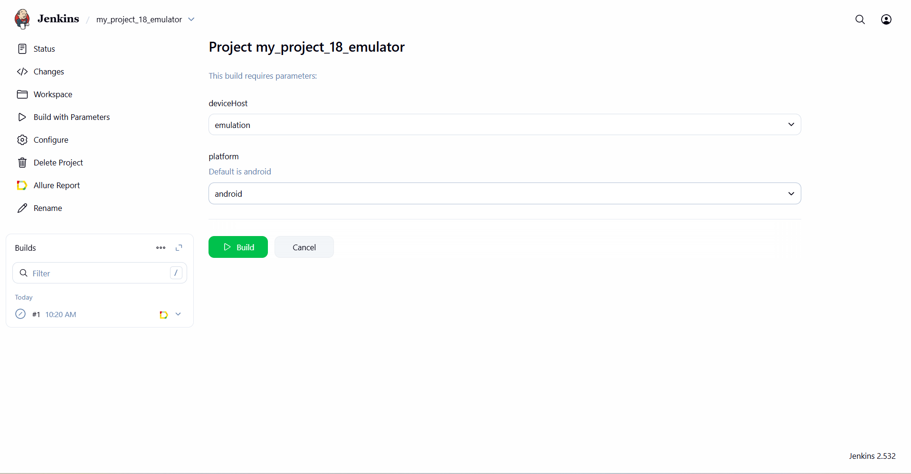
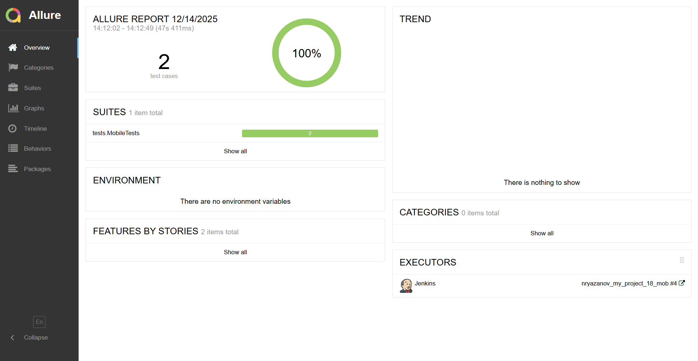
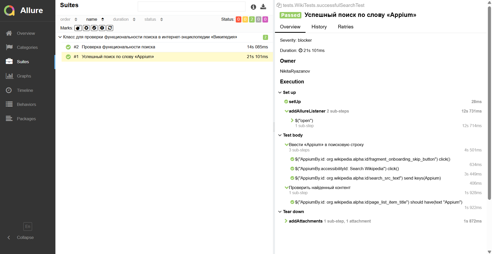
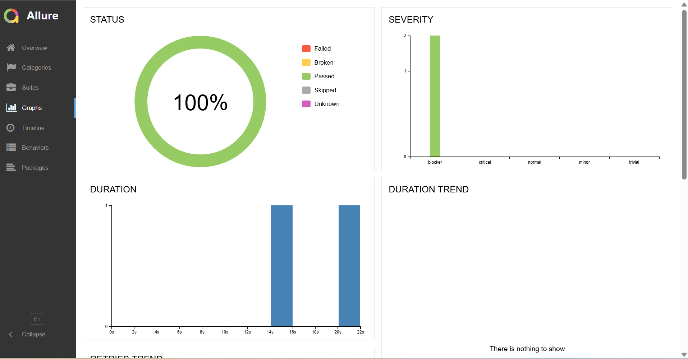
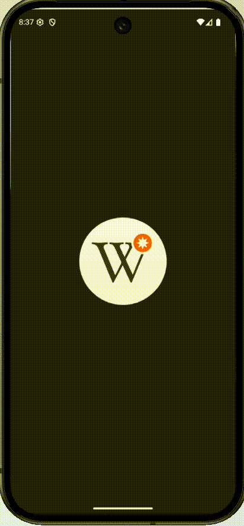

## <a href="https://escape-room-neon.vercel.app/"></a>
# Проект по автоматизации тестирования для мобильного приложения [Wikipedia](https://ru.wikipedia.org/wiki/%D0%97%D0%B0%D0%B3%D0%BB%D0%B0%D0%B2%D0%BD%D0%B0%D1%8F_%D1%81%D1%82%D1%80%D0%B0%D0%BD%D0%B8%D1%86%D0%B0)

* [Репозиторий с проектом](https://github.com/nryazanov13/my_project_18_mob/tree/emulator)

## **Содержание:**
____

* <a href="#tools">Технологии и инструменты</a>

* <a href="#cases">Примеры автоматизированных тест-кейсов</a>

* <a href="#jenkins">Сборка в Jenkins</a>

* <a href="#console">Запуск из терминала</a>

* <a href="#allure">Allure отчет</a>

* <a href="#telegram">Уведомление в Telegram при помощи бота</a>

* <a href="#video">Примеры видео выполнения тестов на Selenoid</a>
____
<a id="tools"></a>
## <a name="Технологии и инструменты">**Технологии и инструменты:**</a>

<p align="center">  
<a href="https://www.java.com/"></a>  
<a href="https://github.com/"></a>  
<a href="https://junit.org/junit5/"></a>  
<a href="https://gradle.org/"></a>  
<a href="https://selenide.org/"></a>  
<a href="https://aerokube.com/selenoid/"></a>  
<a href="https://allurereport.org/"></a>  
<a href="https://www.jenkins.io/"></a>
<a href="https://appium.io/"></a>
</p>

____
<a id="cases"></a>
## <a name="Примеры автоматизированных тест-кейсов">**Примеры автоматизированных тест-кейсов:**</a>
____
- ✓ *Проверка роботоспособности функциональности поиска*
- ✓ *Проверка поиска по определенному значению == Appium*

____
<a id="jenkins"></a>
## </a><a name="Сборка"></a>Сборка в [Jenkins](https://jenkins.autotests.cloud/job/037-sandraboticelli-escaperoom-12/)</a>
____
<p align="center">  
<a href="https://jenkins.autotests.cloud/job/my_project_12/"></a>  
</p>

### Параметры сборки в Jenkins
- **deviceHost** – указывает, на каком стенде будет запускаться тесты  
  Возможные значения: `browserstack` (удалённый запуск на BrowserStack), `emulation` (эмулятор) или `real` (реальное устройство).
- **platform** – платформа устройства, на которой выполняются тесты  
  Возможные значения: `android` или `ios`.

---

### Команды для запуска из терминала
Для локального и удалённого (через Jenkins) запуска необходимо передать те же параметры `deviceHost` и `platform`.

#### Локальный запуск всех тестов
```bash
./gradlew clean test -DdeviceHost=${deviceHost} -Dplatform=${platform}
```
___
<a id="allure"></a>
## </a> <a name="Allure"></a>Allure [отчет](https://jenkins.autotests.cloud/job/nryazanov_my_project_18_mob/4/allure/#suites)</a>
___

### *Основная страница отчёта*

<p align="center">  
  
</p>  

### *Тест-кейсы*

<p align="center">  
  
</p>

### *Графики*

  <p align="center">  


  
</p>

____
<a id="video"></a>
## </a> Пример видео выполнения тестов на эмуляторе андроид

<p align="center">
   
</p>